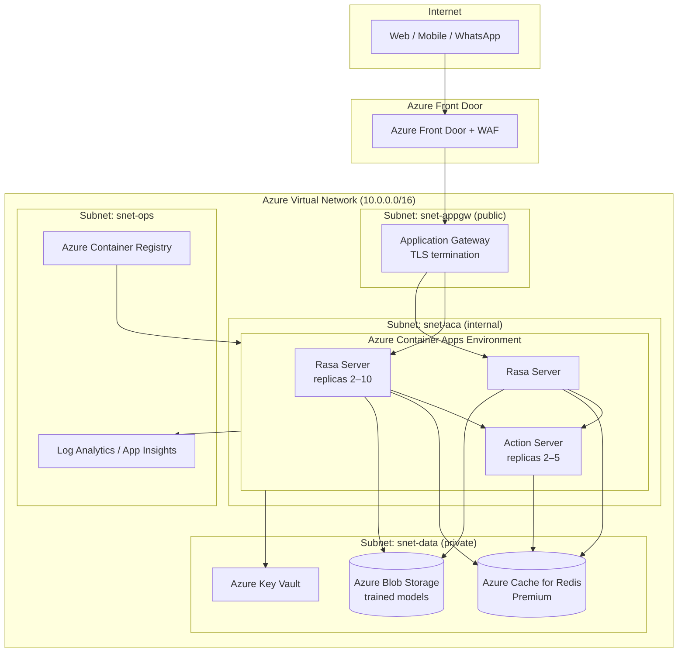
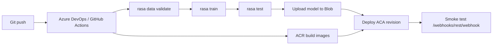

# Azure Deployment Architecture — AutoMaroc Location Chatbot

This document describes a production-oriented Azure deployment for the Rasa car-rental chatbot using Docker containers, aligned with the existing project architecture (Rasa server + Action Server + Redis).

## High-level architecture



## Component mapping

| Local (docker-compose) | Azure service | Role |
|------------------------|---------------|------|
| `rasa` service | Azure Container Apps (ACA) | NLU + dialogue management, REST API |
| `action-server` | Azure Container Apps | Custom actions (pricing, availability, confirmation) |
| `redis` | Azure Cache for Redis (Premium) | Tracker store + lock store |
| `nginx` | Application Gateway + Front Door | HTTPS, routing, rate limiting, WAF |
| `models/` volume | Azure Blob Storage | Versioned `.tar.gz` model artifacts |
| — | Azure Key Vault | Secrets (Redis password, channel tokens) |
| — | Azure Monitor + App Insights | Logs, metrics, alerts |

## Container images

Build and push from CI/CD:

```bash
az acr build --registry automarocacr --image rasa-server:latest -f rasa/Dockerfile rasa
az acr build --registry automarocacr --image rasa-actions:latest -f actions/Dockerfile actions
```

**Recommendation:** Train models in CI (GitHub Actions / Azure DevOps), upload to Blob Storage, and mount or download at container startup instead of baking models into every image rebuild.

## Networking

### Virtual network layout

| Subnet | CIDR | Purpose |
|--------|------|---------|
| `snet-appgw` | 10.0.1.0/24 | Application Gateway public frontend |
| `snet-aca` | 10.0.2.0/23 | Container Apps (internal ingress) |
| `snet-data` | 10.0.4.0/24 | Redis private endpoint |
| `snet-ops` | 10.0.5.0/24 | ACR private endpoint, jump box (optional) |

### Traffic flow

1. Client → **Azure Front Door** (global CDN, DDoS, WAF rules).
2. Front Door → **Application Gateway** (TLS 1.2+, certificate from Key Vault).
3. App Gateway → **Container Apps ingress** (internal, HTTPS to Rasa `:5005`).
4. Rasa → Action Server via internal ACA DNS (`http://automaroc-actions:5055/webhook`).
5. Rasa + Actions → Redis via **private endpoint** (no public Redis).

### Security groups

- Deny all inbound to `snet-data` except from `snet-aca`.
- Allow outbound from ACA to ACR, Blob, Key Vault, Redis, Monitor.
- No public IP on Redis or Action Server.

## Scalability

### Horizontal scaling (Container Apps)

| Service | Min replicas | Max replicas | Scale rule |
|---------|--------------|--------------|------------|
| Rasa server | 2 | 10 | HTTP concurrent requests > 50 per replica |
| Action server | 2 | 5 | CPU > 70% or HTTP queue depth |
| Redis | 1 (cluster) | — | Premium P1+ with clustering for HA |

**Session affinity:** Enable sticky sessions on Application Gateway when using in-memory fallbacks; with Redis tracker store, affinity is optional.

**Model updates:** Blue/green deployment — deploy new revision with new model blob URL, shift traffic 10% → 100% after `rasa test` passes in staging.

### Vertical scaling

- Start: Rasa 2 vCPU / 4 GiB, Actions 1 vCPU / 2 GiB.
- Load test with Locust/k6; scale ACA workload profiles before maxing replicas.

## Storage

### Model storage (Blob)

```
Storage account: automarocmodels
Container: rasa-models
  └── production/
        ├── model-20260704.tar.gz
        └── model-latest.tar.gz  (symlink metadata)
```

Mount via Azure Files or download on startup:

```yaml
# Container Apps env
RASA_MODEL_URL: https://automarocmodels.blob.core.windows.net/rasa-models/production/model-latest.tar.gz
```

### Conversation persistence

- **Tracker store:** Azure Cache for Redis (configured in `endpoints.yml`).
- **Analytics (optional):** Stream events to Azure Event Hubs → Azure Data Explorer / Synapse for BI dashboards.
- **Backup:** Redis geo-replication (Premium) + nightly RDB export to Blob.

### Logs

- Container stdout → Log Analytics workspace.
- Retention: 90 days hot, archive to Blob after.

## Configuration & secrets

Store in Key Vault, reference from Container Apps:

| Secret | Usage |
|--------|-------|
| `redis-password` | Tracker + lock store |
| `facebook-page-token` | Messenger channel (future) |
| `twilio-auth-token` | WhatsApp / SMS (future) |

Production `endpoints.yml` fragment:

```yaml
action_endpoint:
  url: "http://automaroc-actions.internal:5055/webhook"

tracker_store:
  type: redis
  url: automaroc-redis.redis.cache.windows.net
  port: 6380
  password: ${REDIS_PASSWORD}
  use_ssl: true

lock_store:
  type: redis
  url: automaroc-redis.redis.cache.windows.net
  port: 6380
  password: ${REDIS_PASSWORD}
  use_ssl: true
```

## Environments

| Environment | ACA env | Redis | Model source | Ingress |
|-------------|---------|-------|--------------|---------|
| Dev | `aca-automaroc-dev` | Basic C0 | Local train | Internal only |
| Staging | `aca-automaroc-stg` | Standard C1 | Blob staging | App Gateway (limited IP) |
| Production | `aca-automaroc-prd` | Premium P1 | Blob production | Front Door + App Gateway |

## CI/CD pipeline (recommended)



## Monitoring & alerting

| Metric | Alert threshold |
|--------|-----------------|
| Rasa HTTP 5xx rate | > 1% over 5 min |
| Action server latency p95 | > 2 s |
| Redis memory | > 80% |
| NLU fallback rate | > 15% of turns |
| Container restarts | > 3 in 10 min |

Integrate Application Insights OpenTelemetry exporter on Action Server for custom action timings.

## Future production enhancements

1. **Channels:** WhatsApp (Twilio / Meta), Microsoft Teams, web chat widget (REST channel already enabled).
2. **Real backend:** Replace simulated availability/pricing with REST calls to a rental ERP API (Azure API Management).
3. **Multi-region:** Front Door origin groups in West Europe + France Central; Redis active geo-replication.
4. **Private LLM fallback:** Azure OpenAI for `action_default_fallback` rephrasing when confidence is low.
5. **Zero-trust:** Managed Identity from ACA to Blob, Key Vault, and Redis (AAD auth preview).
6. **Compliance:** GDPR — Redis TTL aligned with `session_expiration_time`, export/delete API for conversation data.

## Quick start (local Docker)

```bash
docker compose up --build -d
curl http://localhost:5005/status
curl -X POST http://localhost:5005/webhooks/rest/webhook \
  -H "Content-Type: application/json" \
  -d '{"sender":"test","message":"Bonjour"}'
```

With reverse proxy profile:

```bash
docker compose --profile with-proxy up --build -d
curl http://localhost:8080/status
```

## Cost estimate (production starter)

| Service | SKU | Approx. monthly |
|---------|-----|-----------------|
| Container Apps (Rasa + Actions) | Consumption, 2–4 replicas | $80–200 |
| Azure Cache for Redis | Premium P1 | $250 |
| Application Gateway | Standard v2 | $150 |
| Front Door | Standard | $35+ |
| Blob + Log Analytics | Pay-as-you-go | $20–50 |

Scale costs with traffic; use Dev/Stg SKUs for non-production workloads.
